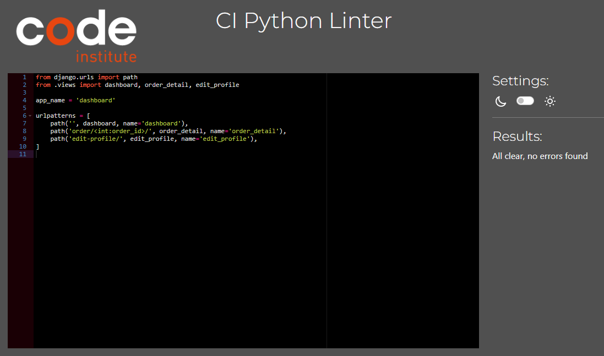
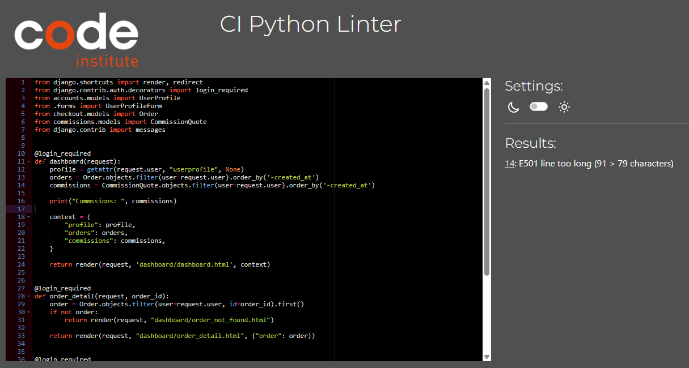
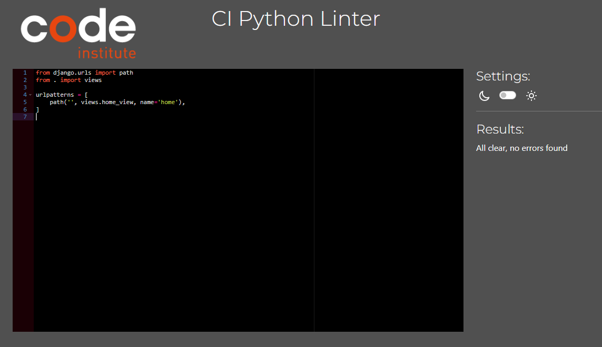
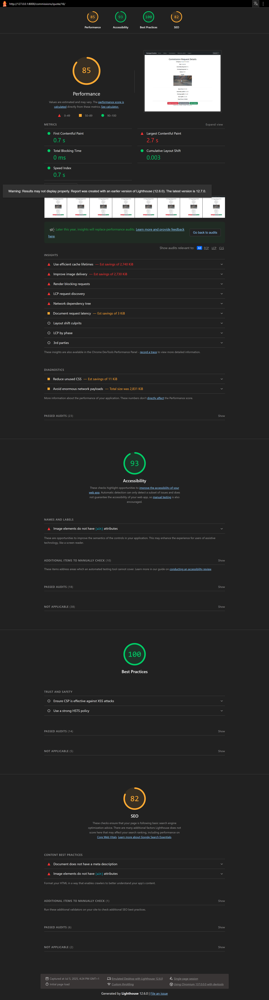
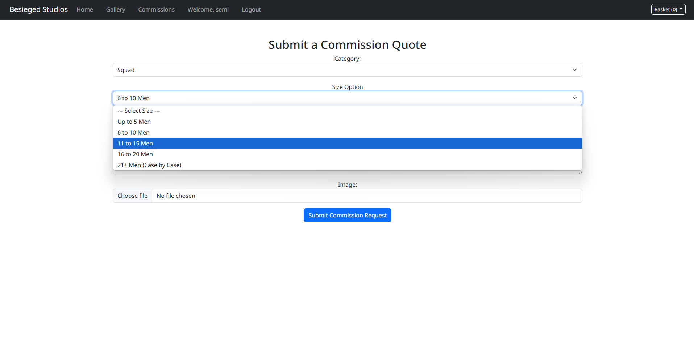
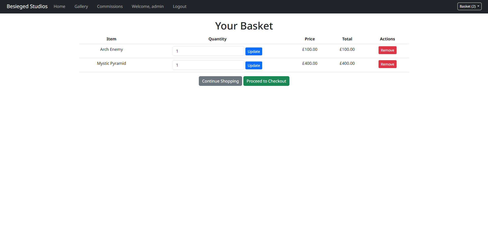
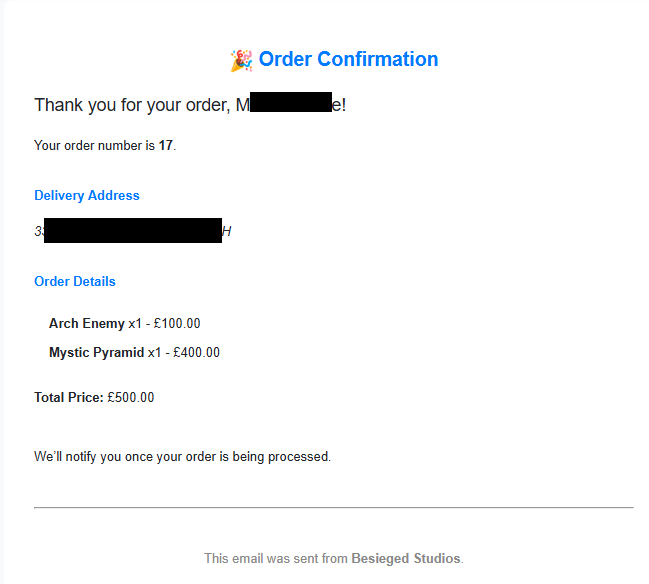

# Besieged Studios
<h1 align="center">Miniature Painting Commission Website – Django Full Stack App</h1>

[ Live Project on Heroku](https://besieged-studios-ea457ee5d01e.herokuapp.com/)


##  Table of Contents

1. [Project Concept](#project-concept)
2. [User Experience (UX)](#user-experience-ux)
    - [External User Goals](#external-users-goal)
    - [Site Owner Goals](#site-owners-goal)
3. [Features and Functionalities](#features-and-functionalities)
4. [Project Structure](#project-structure)
5. [Technologies Used](#technologies-used)
6. [Testing](#testing)
    - [Emails](#emails)
    - [Stripe Payments](#stripe)
    - [Bootstrap](#Bootstrap)
    - [Validation](#validation)
      - [HTML](#html-validated-with-w3c-html-validator)
      - [CSS](#css-w3c-css-validator)
      - [JS](#js-jshint-confirms-syntax-validity)
      - [PYTHON](#python-httpspep8ciherokuappcom-)
    - [Performance](#performance)
      - [Home page](#Home-page)
      - [Gallery](#gallery)
      - [Dashboard](#dashboard)
      - [Commissions](#commissions)
    - [Manual Testing](#manual-testing)
      - [User Registration](#User-Registration)
      - [Commission Form](#Commission-Form)
      - [Gallery Flow](#gallery-flow)
      - [Checkout Flow](#Checkout-Flow)
      - [Dashboard](#dashboard)
    - [Known Bugs](#known-bugs)
7. [Further Improvements](#further-improvements)
8. [Deployment](#deployment)
    - [Heroku](#heroku)
    - [Forking the GitHub Repository](#forking-the-github-repository)
    - [Making a Local Clone](#making-a-local-clone)
9. [Credits](#credits)
    - [Code](#Code)
    - [media](#Media)
    - [Acknowledgements](#Acknowledgements)

#   Project Concept
Title: Miniature Painting Commission Website (Besieged Studios)

## User Experience (UX)

### First-Time Visitors
  - Discover the purpose of the site easily
  - View examples of painted miniatures
  - Request quotes quickly and intuitively

### Returning Visitors
  - Log in and track orders
  - Manage payments
  - View previously commissioned work

### Frequent Users
  - Communicate with the artist
  - Submit feedback and testimonials
  - Repeat commission requests easily

###  External User's Goal:
Commission a custom miniature painting service tailored to their preferences and budget.

###  Site Owner's Goal:
Earn revenue by showcasing prior work, receiving commissions, and managing client interactions efficiently.

##  Features and Functionalities
  - Core Features
  - Gallery/Portfolio:

  - Display completed miniature projects categorized by type (e.g., fantasy, sci-fi, dioramas).
    - Showcase testimonials from satisfied clients alongside project images.

  - Commission Form with Quote Calculator:
    - Allow users to specify their miniature painting needs, including:
      - Type of miniature (e.g., single figure, squad, diorama).
      - Size (e.g., 28mm scale, 54mm scale).
      - Level of detail (tabletop standard, display standard, competition standard).
  - Provide a live quote preview using JavaScript.
  - Ensure the final quote is calculated securely on the server.

  - User Accounts:
    - Enable users to create accounts to track their commission status and access completed works.

  - E-Commerce Integration:
    - Integrate Stripe to handle payments for commission deposits or full orders.

  - Order Management (Admin Dashboard):
    - Allow the site owner to manage orders:
    - View and update order status (e.g., "Pending", "In Progress", "Completed").

  - Feedback Mechanism:
    - Allow clients to accept the finished miniature or request minor adjustments.
    - Once accepted, clients can submit a testimonial that gets displayed on the site.

##  Advanced Features (Nice-to-Have)
  - Custom Gallery Display:
    - Create an interactive, JavaScript-powered carousel or grid with filters (e.g., by category, painting level).
    
  - Dynamic Pricing Adjustments:
    - Include optional add-ons (e.g., custom bases, weathering effects) that dynamically update the quote.

##  Project Structure


### Apps

  - Gallery App:
    - Manages the display of completed works and testimonials.

  - Commission App:
    - Handles commission requests, orders, and payments.
      - Select Category:
        - Single Miniature
        - Squad
        - Colossal Monster/Vehicle
        - Terrain

    - Select Sub-options (dynamic form inputs):
        - For Squad: choose squad size
        - For Terrain: choose max dimension
        - Case-by-case flag if special size exceeds limit

    - Auto-calculate Base Price + Assembly/Priming %
    - Upload Image (optional)
    - Add Notes / Requirements
    - Show Price or Flag for Manual Quote
    - Submit to Dashboard:
      - Status = "Ready to Checkout" or "Pending Quote"

  - Authentication App:
    - Manages user registration, login, and profiles.
    - Email Verification System
      - The app includes a commented-out custom email verification flow using Django Allauth. It supports public resending of confirmation emails and customized
        confirmation pages. This feature is disabled during submission to streamline access for assessment, but is fully scaffolded for future production use.

  - Admin Dashboard App:
    - Provides a management interface for the site owner.

##  Technologies Used

### Languages

  - HTML5
  - CSS3
  - JavaScript
  - Python

### Frameworks & Libraries
  - [Django 5.1](https://www.djangoproject.com/)
  - [PostgreSQL](https://www.postgresql.org/)
  - [Bootstrap 5](https://getbootstrap.com/)
  - [Stripe](https://stripe.com/)
  - [Allauth](https://django-allauth.readthedocs.io/)
  - [Whitenoise](http://whitenoise.evans.io/)
  - [Gunicorn](https://gunicorn.org/) – for Heroku

##  Testing

### Emails:
    
  - Account creation confirmation emails (via Gmail)
  - Tested using temp-mail.org
  - Order confirmation
  - Commission quotation pending email

###  Stripe:
  - Used official [Stripe test cards](https://stripe.com/docs/testing):
  - To test the Stripe payment system the following test scenarios were used:
    - Successful payment Card Number: 4242 4242 4242 4242
    - Failed payment Card Number: 4000 0000 0000 0002 (Declined payment)
    - Authentication Required (3D Secure) Card Number: 4000 0025 0000 3155 (Requires extra authentication)
    - Insufficient Funds Card Number: 4000 0000 0000 9995
  - Using the above card numbers, any future expiry date, any 3 digit CVC number and a valid postcode.

###  Bootstrap
  - Alerts:
    - Styling:
      - Custom styling for alerts was applied inline due to Bootstrap's CSS specificity preventing external stylesheet overrides during runtime.

### Validation

#### **HTML**: Validated with [W3C HTML Validator](https://validator.w3.org/)
  - Home
    - 
  - Gallery
    - 
  - Commissions
    - 
    - 
  - Dashboard
    - 
  - Checkout
    - 
  - Conclusion
    - All rendered HTML pages were passed through the W3C HTML Validator for markup correctness. The following points were noted:
      - Pages pass validation once Django template tags are rendered out.
      - Minor parse errors were reported around:
        - Use of arrow functions (=>) in JavaScript (modern and valid)
        - Encoded characters like &#x27; representing '
      - These are false positives and do not affect the browser rendering or accessibility.

#### **CSS**: W3C CSS Validator
  - Base CSS
    - 
  - Conclusion
    - No errors shown
    - One warning where Imported style sheets are not checked in direct input and file upload modes of the validator

#### **JS**: [JSHint](https://jshint.com/) confirms syntax validity
  - Commissions
    - 
  - Conclusion
    - JSHint warnings were shown for use of modern JavaScript (ES6), such as const and =>. These were resolved by configuring the validator to support ES6 using /*
      jshint esversion: 6 */. 
    - Otherwise no errors were found.

#### **Python**: (https://pep8ci.herokuapp.com/) — 
  - Accounts
    - 
    - 
    - 
    - 
    - 
    - 
  - Basket
    - 
    - 
    - 
  - Checkout
    - 
    - 
    - 
    - 
  - Commissions
    - 
    - 
    - 
    - 
  - Dashboard
    - 
    - 
    - 
  - Gallery
    - 
    - 
    - 
  - Home
    - 
    - 
  - Besieged Studios
    - 
    - 
  - Conclusion
    - Python files were validated using flake8.
      - All errors were fixed, except for E501 (line too long), which remains on a small number of lines where:
        - URLs, redirects, or path strings would become unreadable if broken.
        - The line is still within 100–120 characters and readable.
      - The Code conforms to clean code practices with descriptive names, consistent indentation, and logical organization.

### Performance

[Google Lighthouse](https://developers.google.com/web/tools/lighthouse):

#### Home page
    
  - Desktop
    - 
  - Mobile
    - 

#### Gallery

  - Desktop
    - 
  - Mobile
    - 

#### Dashboard

  - Desktop
    - 
  - Mobile
    - 

#### Commissions

  - Desktop
    - 
  - Mobile
    - 

### Manual Testing

- Logged in/logged out user access
- Admin permission checks
- Invalid payment scenario handling
- Form validation edge cases

#### User Registration
- Valid email and password -> account created
  - 
  - 
  - 
- Invalid email format -> shows validation error
  - 
- Existing user login works correctly
  - 
- Email confirmation bypassed for testing to be applied at a later stage (`ACCOUNT_EMAIL_VERIFICATION = "none"`)

#### Commission Form
- Selecting “Squad” enables dynamic squad size input
  - 
  - 
  - 
- Invalid file upload (to be added at a later stage with form errors)
- Price updates correctly with selected options to produce quote which can be sent to the basket
  - 
  - 

#### Gallery Flow
- Selecting an item from the gallery
  - 
- Sending an item to the basket
  - 
- Item is saved to the basket and ready to checkout
  - 

#### Checkout Flow
- Basket summary correct on checkout page
  - 
- Address saved to session before payment (use saved address feature to be added)
  - 
- Stripe redirects to success or cancel page correctly
  - 
  - 
  - 
  - 
- Order email sent upon success (verified via console)
  - 

#### Dashboard
  - Access quoted commissions
    - 
  - View previous orders(order again feature to be added)
    - 
  - Edit contact details
    - 

### Known Bugs

  - Email verification was causing a redirect loop (disabled via `ACCOUNT_EMAIL_VERIFICATION = "none"` during assessment).
  - When altering the value of commission items in the basket dropdown the site throws a page 404 error. You wouldn't normally ask for more than one but it is
    something that requires attention should this be used in a production environment.
  - Bootstrap alert styles sometimes require inline overrides due to specificity.

## Further Improvements

  - Enable custom email verification flow for production
  - Allow users to edit their orders pre-payment
  - Add use of saved addresses to speed up checkout
  - Add gallery filters for tags, paint level, etc.
  - Upload photos of the completed miniature for client review.
  - Approve or reject client requests for revisions.
  - Overall visual improvements

## Deployment

### Heroku

The project was deployed to Heroku using the following steps:

1. Create a new Heroku app:
    - `heroku create`
2. Push the repository to Heroku:
    - `git push heroku master`
3. Set up the necessary environment variables on Heroku, including database URL (PostgreSQL), secret keys, and Stripe keys.

### Forking the GitHub Repository

By forking the GitHub Repository, you can make a copy of the original repository to view and make changes without affecting the original repository.

1. Log in to GitHub and locate the [GitHub Repository](#)
2. Click on the "Fork" button.

### Making a Local Clone

1. Log in to GitHub and locate the [GitHub Repository](#)
2. Click "Clone or download" and copy the URL.
3. Open Git Bash.
4. Change the current working directory to the location where you want the cloned directory.
5. Type `git clone`, and then paste the URL.

(```bash)
- $ git clone (https://github.com/your-username/repository-name/)

## Credits

### Code
  - Django Allauth Documentation
  - Stripe Official Docs
  - Bootstrap examples from getbootstrap.com

### Media
  - All photos belong to the site owner unless stated otherwise
  - Home page images generated using OpenAI ChatGPT

### Acknowledgements
  - Code Institute mentors
  - College of Bristol Tutor support
  - My family and friends for testing
  - Discord developer peers for feedback

This project was submitted as part of Unit 4: Full Stack Frameworks with Django for the Level 5 Diploma in Web Application Development.
